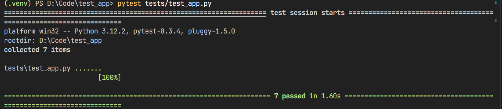
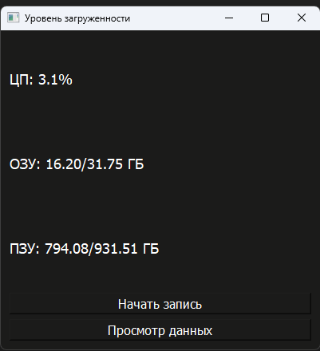
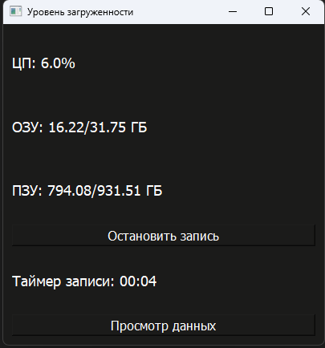
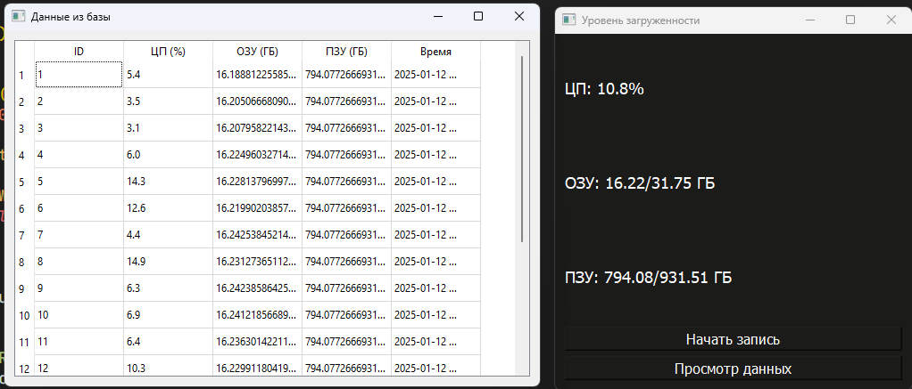

# Тестовое задание

## Описание
Это приложение для мониторинга системы, которое отображает данные о загрузке процессора (ЦП), доступной оперативной памяти (ОЗУ) и свободном месте на диске. Приложение обновляет эти показатели в реальном времени. Также есть возможность начать запись статистики в базу данных SQLite, которая сохраняет данные о загрузке системы (ЦП, ОЗУ, диск) с временной меткой. В приложении предусмотрена кнопка для просмотра сохранённых данных в виде таблицы. Время записи также отображается в формате таймера.

## Стек технологий
- Языки программирования: Python
- Фреймворки: PyQt5, PyTest
- База данных: SQLite
- Другие технлогие: Git

## Установка

Чтобы запустить данный проект на своем локальном компьютере, выполните следующие шаги.

1. Установите Git для клонирования репозитория:
### Linux
```bash
sudo apt install git
```
### MacOs
```bash
brew install git
```
### Windows
Скачайте установщик с https://git-scm.com

2. Склонируйте репозиторий:
```bash
git clone https://github.com/ivalukyan/test_app.git
```

3. Перейдите в папку с кодом:
```bash
cd test_app
```

4. Установите зависимости:
### Windows или MacOs
```bash
pip install -r requirements.txt
```
### Linux
```
pip3 install -r requirements.txt
```

5. Запустите скрипт:
### Windows или MacOs
```bash
python app.py run
```
### Linux
```bash
python3 app.py run
```
### ВАЖНО! 
При ошибке запуска на Linux:
### Debian или Ubuntu
```bash
sudo apt update
sudo apt install libx11-xcb1 libxcb1 libxcb-render0 libxcb-shm0 libxcb-icccm4 libxcb-image0 libxcb-keysyms1 libxcb-randr0 libxcb-render-util0 libxcb-shape0 libxcb-sync1 libxcb-xfixes0 libxcb-xinerama0 libxcb-xkb1 libxkbcommon0 libxkbcommon-x11-0
```

## Тестирование
Запустите тестирование:
```bash
pytest tests/test_app.py
```


## Пример работы программы







